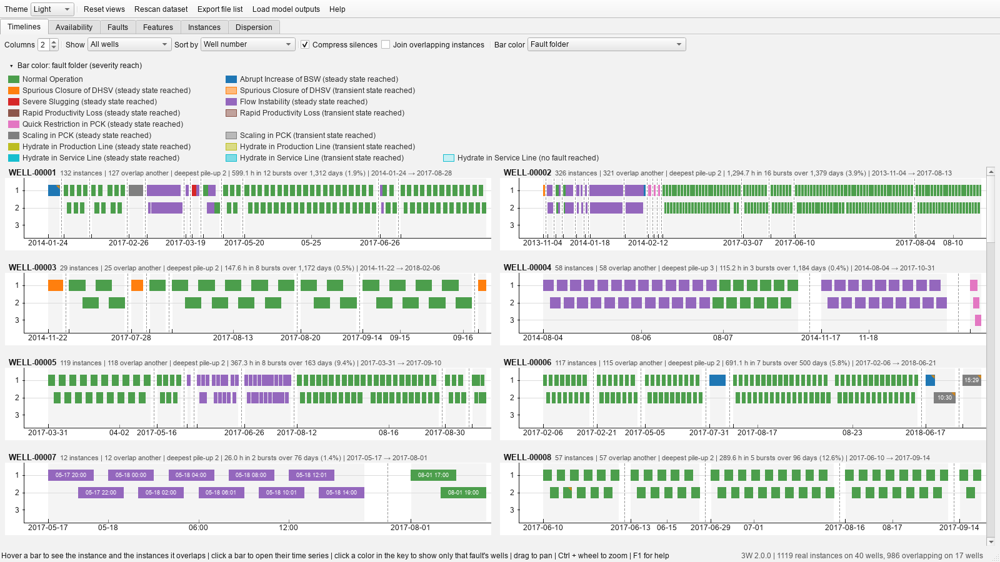
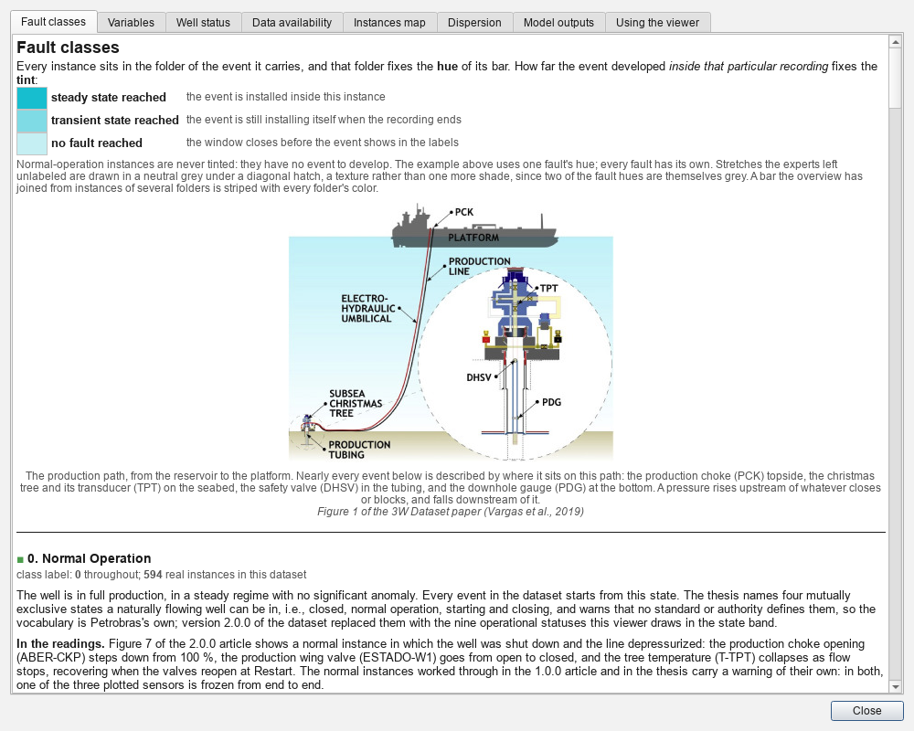

# 3W Real Instances Viewer

A desktop GUI to inspect the **real instances** of the [Petrobras 3W dataset](https://github.com/petrobras/3W)
that deploys many of the views and analysis previous works on the dataset have contributed.
Inspections include:
how the real instances of a well overlap in time and how their fault labels differ,
what their sensors actually recorded,
and how the instances of one fault compare across wells.
For more info on the 3W dataset (and specifically version 2.0.0), check out its repository.



> [!WARNING]
> Given the amount of data the app handles, caching is required for a smooth experience.
> First passes on data may take several seconds, and the app requires at least 1.4 GB of RAM (2.0 GB recommended).

## Overview of the GUI

This GUI is organized into 6 pages, each concerned with a question or exploration of an aspect of the dataset,
summarized in the following table and detailed in their own READMEs.

| Page                                    | Question/Exploration                                                                                 | Content                                                                                                                                                                                                                               |
| --------------------------------------- | ---------------------------------------------------------------------------------------------------- | ------------------------------------------------------------------------------------------------------------------------------------------------------------------------------------------------------------------------------------- |
| [Timelines](docs/gui/Timelines.md)       | Show at a glance how instances and fault classes spread out across time per well                     | One interactive timeline per well; bars colored by fault, or optionally by sensor availability, measurements, a descriptor, the Toolkit's rule, the map or a loaded model; hover highlights overlaps, click opens the instance window |
| [Availability](docs/gui/Availability.md) | Show what each sensor actually recorded, not just what the file declares                             | Three matrices — sensor availability (live/frozen/absent shares), sensor pairs (how often two sensors are recorded at the same instant) and sensor correlations — grouped by fault class, well, or the instances of one             |
| [Faults](docs/gui/Faults.md)             | Compare how one fault looks across every well it occurred on                                         | Every real instance of one fault, aligned at its onset, one section per sensor, as small multiples or overlaid, in the time, distribution or spectrum domain                                                                          |
| [Features](docs/gui/Features.md)         | Compare what one sensor reads across every fault class                                               | One sensor fixed, one section per fault class, the same layouts, domains and transforms as the Faults page                                                                                                                            |
| [Instances](docs/gui/Instances.md)       | Place every real instance on one plane by what its sensors amount to                                 | A 2D embedding (PCA, t-SNE or UMAP) of each instance's descriptors or DTW shape, colored by class, well, cluster, typicality, novelty or model agreement, with clustering scores and a label-audit of disagreements                   |
| [Dispersion](docs/gui/Dispersion.md)     | See two sensors against each other, the way the historian's interpolation shows up in a scatter plot | A point cloud, with its density, of two sensors over a scope (every instance, one class or one well), colored by class, well or label period, thinnable to genuine measurements alone                                                 |

Furthermore, an *instance window* is available for visualizing the signals and labeling of an instance (see [the color code](docs/gui/ColorCode.md)).
This window can be accessed whenever user clicks on a representation of an instance (horizontal bar in the Timelines page, points in cluster maps, etc.), and is [documented in detail](docs/gui/InstanceWindow.md).
Last but not least, `F1` anywhere (or clicking on `Help`) opens the Help modal, which explains what is on screen.



## Plausible ranges

The GUI indicates to the user when a measurement is outside its plausible range.
Each kind of measurement has its own range, as shown below, found by a survey of every instance of
3W 2.0.0 ([`backend/config.py`](src/overlap_viewer/backend/config.py)): a magnitude past 1×10⁸ is a
sentinel value or an instrument off by orders of magnitude in every case surveyed, a negative
pressure or choke opening is physically impossible and so is an opening above 100 %, and the
temperature band is wide enough to hold a genuine blowdown (as cold as −33.8 °C) while still
catching the sentinels (−999, 30,000 °C). Flow rates are held to the magnitude rule only, having no
sentinel-free band of their own the way pressure and temperature do.

| Physical quantity | Unit  | Plausible Min. | Plausible Max. |
| ----------------- | ----- | -------------- | -------------- |
| Pressure          | Pa    | 0              | 1×10⁸        |
| Temperature       | °C   | −50           | 250            |
| Valve opening     | %     | 0              | 100            |
| Flow rate         | m³/s | −1×10⁸      | 1×10⁸        |

## Running

Requires Python 3.11 or newer, [uv](https://docs.astral.sh/uv/) and a local copy of the 3W dataset.

```bash
uv sync                    # creates .venv with PySide6, pyqtgraph, pandas, numpy, pyarrow
uv run overlap-viewer --raw-dir /path/to/3W/dataset
```

Without `--raw-dir`, the dataset is taken from the `OVERLAP_VIEWER_RAW_DATA_DIR` environment variable,
then from `../3W/dataset`, `dataset` or `3W/dataset` relative to the working directory; if none holds a
dataset, a folder dialog asks for it. `uv run main.py` and `uv run python -m overlap_viewer` are
equivalent entry points.

| Option             | Default             | Meaning                                                                         |
| ------------------ | ------------------- | ------------------------------------------------------------------------------- |
| `--raw-dir PATH` | see above           | root of the 3W dataset (the folder holding`0/` … `9/` and `dataset.ini`) |
| `--columns N`    | 2                   | plots per row of the timelines (1 to 4)                                         |
| `--gap-hours H`  | 12                  | a silence at least this long splits a well's recording into two bursts          |
| `--theme MODE`   | the last one chosen | `light`, `dark`, or `system` to follow the desktop                        |
| `--no-cache`     | off                 | read every instance again instead of using the cached catalogue                 |

The first launch reads the time span and labels of every real instance, and what every sensor
recorded from the footer of each file (about 7 s for the 1,119 instances of 3W 2.0.0, behind a
progress dialog), and caches the result under the platform cache directory
(`~/.cache/overlap-viewer/` on Linux). Later launches validate the cache against the files' sizes
and modification times and open in a few seconds, a progress bar naming each page as it is built
and laid out; any changed, added or removed file triggers a fresh
scan, as does the *Rescan dataset* button, and so does a version of the viewer that records more
about each instance than the cache holds (the label runs the join reads, and the sensor figures the
availability page reads, were added this way). Three figures the footers cannot give are read from
the data the first time they are asked for, each behind its own progress dialog and cached the same
way: the merged figures the availability page's join needs, sensor by sensor and pair by pair, in
one pass (about 30 s); the pair counts of the instances as the dataset stores them (about 9 s); and
the profiles of every sensor of every instance and bar — which samples are measurements, and what
each sensor amounts to — which read every file in full (about 100 s). A pass one page has paid for
is shared with every other.

Only real instances (`WELL-*` files) are shown: simulated and hand-drawn instances have no well to
overlap on and no sensor to lack, and this viewer is about the real ones.

### Optional extras

The core of the viewer needs numpy, pandas, pyarrow, PySide6 and pyqtgraph, and nothing else.
The heavier analyses are grouped into optional extras, one per capability, so that a plain
`uv sync` stays light. A control whose group is not installed is greyed, and its tooltip names the
group and the command that installs it; nothing else changes.

| Group        | Installs     | Enables                                                                                                                         |
| ------------ | ------------ | ------------------------------------------------------------------------------------------------------------------------------- |
| `analysis` | scikit-learn | the Instances map (embeddings, clusterings and their scores, the novelty audit) and the mutual-information matrices             |
| `umap`     | umap-learn   | the UMAP embedding of the Instances map                                                                                         |
| `dtw`      | dtaidistance | the DTW representation of the Instances map: each instance's shape compared with the others of its class, the 3W Toolkit's rule |

```bash
uv sync --extra analysis           # one group
uv sync --all-extras               # every group
```

The table lives in [`backend/extras.py`](src/overlap_viewer/backend/extras.py) as well as in
`pyproject.toml`, and the tests check that the two agree.

## Layout

The viewer is composed of three packages/layers which dependencies grow from one to the next:
`backend` (data reading and loading), `algorithms` (data processing) and `frontend` (presentation).
A bird's eye view of the project's organization is shown below; every package, file and its public
functions are documented in detail in the [source `README`](src/README.md).

```
.
├── pyproject.toml            standalone uv project (package overlap_viewer, script overlap-viewer, the optional extras)
├── main.py                   runs the viewer from a checkout without installing
├── docs/
│   ├── gui/                  one detailed README per page, linked from the table above
│   ├── assets/               screenshots, taken again by scripts/screenshots.py, the platform schematics the help shows
│   └── papers/               the 3W data articles, the thesis and the graduation project the help draws on
├── examples/                 one explained example of every file the viewer reads or writes, with its provenance
├── scripts/                  what produces the examples and the figures, outside the GUI: export_file_list.py, pca_control_chart.py, screenshots.py
├── tests/                    the test suite, one module per subpackage or analysis, sharing a synthetic 3W layout
└── src/overlap_viewer/
    ├── app.py                command line and start-up
    ├── backend/              what the data is — pandas, numpy and pyarrow only
    ├── algorithms/           what is computed from the data — numpy only; anything heavier is an optional extra
    └── frontend/             how it is shown — PySide6 and pyqtgraph
```

## Integration with 3W Toolkit

The viewer meets the [3W Toolkit](https://github.com/petrobras/3W) in two places, by rule and by
file.

**By rule.** The Toolkit's preprocessing step `CleanSignals` decides, per instance and per sensor,
whether a signal is to be believed: fitted on the dataset, it puts bounds at the quartiles of the
instances' means and spreads, three interquartile ranges out on either side, discards the sensor
in an instance whose mean or spread falls outside them (a spread below 1e-6 always fails), drops a
sensor entirely missing in 60 % or more of the instances, and leaves the valve states alone. The
profile pass holds exactly what the rule needs, so the viewer applies it at no cost
([`algorithms/cleaning.py`](src/overlap_viewer/algorithms/cleaning.py)) and lets its thresholds
move: *Toolkit's CleanSignals*, on the Availability page, marks every cell in which the rule would
discard the sensor in at least one instance of the row with a slash, greys the columns it would
drop, and says in the tooltip how many and which bound; the *IQR ×* and *drop if missing in* boxes
move the thresholds; the rule is fitted afresh on the joined bars when the view is joined. The
Timelines offer *Bar color: Sensors the Toolkit's CleanSignals keeps*, every bar tinted by the
share of its live sensors the rule keeps, hovering it naming what the rule discards and why. The
header of every block of an instance window names the sensors the rule would discard in it, once
the rule has been fitted anywhere. One difference is kept on purpose: the profiles describe the
plausible readings, so a sensor whose readings are instrument garbage is not discarded here by a
mean of 10⁴² — it wears the amber mark instead, which says more.

**By file.** *Export file list…*, in the main toolbar, writes the instances the current page has on
show — the wells filtered on the Timelines, the rows of the Availability page, the instances ticked
on the Faults and Features pages, the points of the Instances map, a joined bar as its instances —
as the JSON of a Toolkit `ParquetDatasetConfig` with `split="list"`, each file a path relative to
the dataset root, which the Toolkit loads with `ParquetDatasetConfig(**json.load(open(path)))`;
its provenance is written beside it. [`scripts/export_file_list.py`](scripts/export_file_list.py)
writes the same from the command line, by fault class and by well, and
[`examples/`](examples/README.md) holds one it produced, the severe-slugging instances of
WELL-00014, with its provenance.

**What cannot come back.** The Toolkit's `ModelAssessment` exports `predictions_<timestamp>.csv`
with the columns `true_values`, `predictions`, `model_name`, `task_type` and `timestamp`: one row
per window the model scored, in the order the windows were fed, with no instance and no instant in
it. Nothing in that file says which file, let alone which second, a prediction belongs to, so the
viewer cannot draw it onto the data. The viewer's own model-output format (next section) is what
such an export would have to carry.

## Importing model outputs

The viewer displays what a model said; it does not train one. For a model's verdicts to be drawn
onto the data, every verdict has to say which instance and which instant it is about, so the viewer
defines the format itself ([`backend/model_outputs.py`](src/overlap_viewer/backend/model_outputs.py)),
the smallest one that says both, and ships an example of it with its provenance written down.

**The format** is a folder: `model.json` beside one `<fault_class>/<instance>.parquet` per instance
scored, laid out as the dataset is. `model.json` holds `name`; `kind`, `"detection"` for a model
that says *anomalous or not* and `"classification"` for one that names the event by its 3W class
number; `labels`, the meaning of every label value the files carry; a `description`; and
`provenance`, who produced the outputs, with what script and parameters, on which dataset version,
when. Each parquet file has the `timestamp` of every sample scored as its index, an integer `label`
column and, optionally, a float `score` column. A model need not score every sample, nor every
instance.

**Agreement** is measured against the experts' `class` labels over the stretches where both said
something: a detection model agrees where it says *anomalous* and the label is a fault (transient or
steady) and where it says *normal* and the label is 0; a classification model where its class equals
the fault the label names. The share of the compared time in agreement is the instance's agreement,
computed from the label runs the catalogue already holds, so loading a set of outputs costs only
reading them.

**Where it shows.** *Load model outputs…*, in the main toolbar, opens a folder in the format. Then:
a third band, *model*, under the class band of every instance window, plain where the verdict
agrees with the label under it and **amber where it disagrees**, the header of the block giving the
agreement; *Bar color: Agreement with the model outputs* on the Timelines; *Color by: Model
agreement* on the Instances map; *Sort: Agreement with the model outputs* and *Shade by: Model
outputs* on the Faults and Features pages, the latter shading the label periods behind the small
plots with the model's verdicts in the dataset's own vocabulary (a detector's *anomalous* as the
instance's own fault), so that where the two differ is seen against the trace.

**The example.** [`examples/model_outputs/pca_control_chart_well7`](examples/README.md) holds the
outputs of a PCA control chart over the twelve real instances of WELL-00007: one model fitted on the
well's two Normal Operation instances over the ten analog sensors live in both, Hotelling's T² and
Q followed along every instance of the well, a sample called anomalous beyond the 99th percentile
of either statistic over the training samples. It was produced by
[`scripts/pca_control_chart.py`](scripts/pca_control_chart.py), whose command, parameters and
fitted limits are in the example's `model.json`; on WELL-00007 it agrees with the labels 98 % of
the time on the normal instances and 100 % on the ten severe-slugging ones. It is one producer of
the format among many — the U-Net segmentation of Lopes *et al.*, the Toolkit's own models with an
export that carries the instance and the instant, a hand-labeled review — and the model itself is
not built into the viewer: its outputs are stored and shown.

## Note on sampling

The dataset is sampled once a second, but the sensors were not read once a second. Afrânio Melo
noticed it on the normal instances of WELL-00001 (doctoral thesis, section 4.2.5, in
[`docs/papers/`](docs/papers)): the readings sit on straight lines between a few extremes, the
plant's PI historian having interpolated linearly between the values it archived, and the scatter
plot of two such series shows trajectories that are nothing but the ups and downs of two
interpolations — spurious dynamics and spurious correlations, an impediment to the exploratory
analysis he set out to do, so he stopped there. The viewer takes the direct route he considered
too uncertain to take on the whole dataset: a straight line is a run of samples whose first
difference is constant.

The rule ([`algorithms/interpolation.py`](src/overlap_viewer/algorithms/interpolation.py)): a
sample equal to the one before it is **held**; a sample collinear with both its neighbours, with a
non-zero slope, is **interpolated**; everything else — the ends of every line and the first of
every held run — is a **measurement**, one per value the historian archived. Interpolated and held
together are *filled*. Collinearity needs a tolerance, and the data says which: on the real files
the second differences along a ramp sit in a clean band at 10⁻⁷ to 10⁻⁶ of the reading (the
interpolation was evidently done in single precision; every pressure value is exactly
representable as a 32-bit float) while genuine changes of slope sit at 10⁻⁴ and above, so the
tolerance is one part in a million of the largest reading, in the gap. Exact equality catches only
a third of the ramps. What the test cannot decide it counts as filled — a quantized sensor that
repeats a value for three seconds, or climbs one step a second, draws the very lines the historian
does — and the valve states are not tested at all.

On 3W 2.0.0 the finding is stark. Over every live analog sensor of every real instance, **6 % of
the samples are measurements**, 55 % are interpolated and 39 % held; the median interval between
two measurements is 33 s. Where they are live, P-MON-CKP is read every 12 s, P-PDG every 13 s,
T-TPT every 16 s, QGL every 21 s, P-TPT every 100 s, T-JUS-CKP every two minutes and P-ANULAR
every four. Every figure taken on the 1 Hz grid inherits the lines: the signal-to-noise ratio of
T-JUS-CKP is 36,000 on the grid and 1.5 on its measurements, and its autocorrelation takes seven
minutes to halve on the grid against 73 s on the measurements. The pass that finds this
([`backend/profiles.py`](src/overlap_viewer/backend/profiles.py)) reads every file in full once,
about 100 s for the whole dataset, and keeps the result in the cache; it profiles every sensor of
every instance and of every bar of the joined view as the merged recording it is, and computes the
descriptors of each ([`algorithms/descriptors.py`](src/overlap_viewer/algorithms/descriptors.py):
moments, quantiles, autocorrelation time, signal-to-noise ratio, Gaussianity, Melo's own set) both
on the grid and on the measurements alone, so that wherever a figure taken on the grid is shown
the viewer can say so.

The measurements show in four places: as dots on every trace, in the *Measured vs filled* split of
the availability page, in the Timelines' *Bar color: Measurements of a sensor*, and under the
*Measurements only* tick of the signal views, where the spectrum becomes a Lomb-Scargle
periodogram of the readings at their own instants.

The descriptors travel as columns of the catalogue. *Bar color: Descriptor of a sensor*, on the
Timelines, tints every bar by the autocorrelation time, the signal-to-noise ratio, the Gaussianity
slope, the skewness or the kurtosis of one sensor, ranked among the bars on show; *Sort*, above the
instance lists of the Faults and Features pages, orders the instances by the same figures of the
feature on show, largest first, the tooltip of every instance carrying both the grid's and the
measurements' value. Each has an *on* box choosing the grid or the measurements, and on the grid
the key, the hover and the tooltip carry the caveat that the historian's lines inflate the first
two: on 3W 2.0.0 the autocorrelation time of T-JUS-CKP is 444 s on the grid and 73 s on the
measurements.
