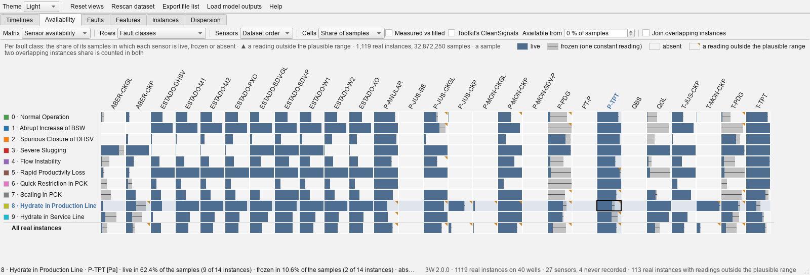
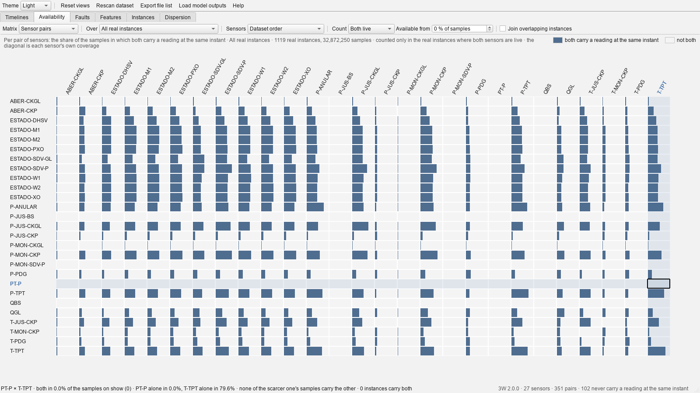
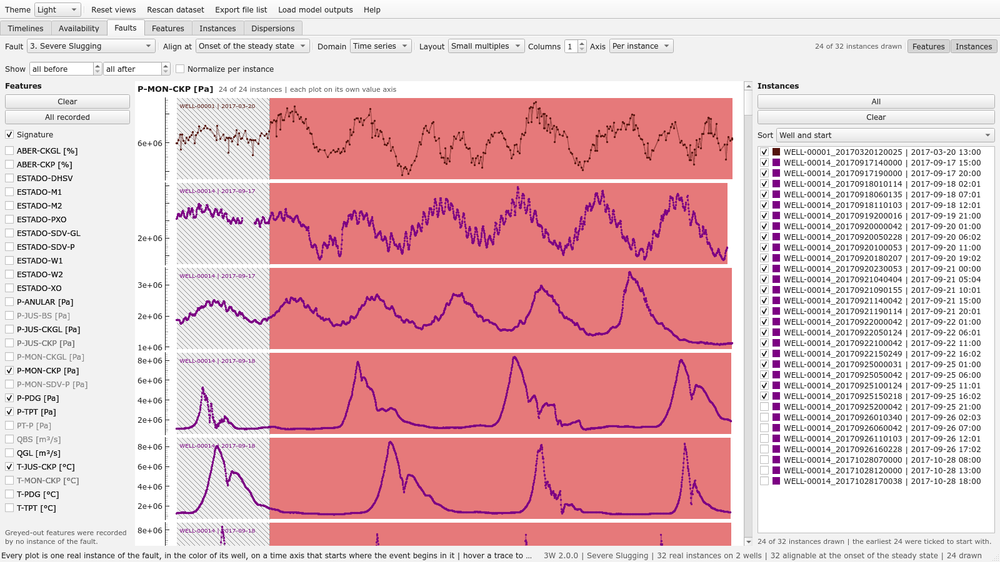
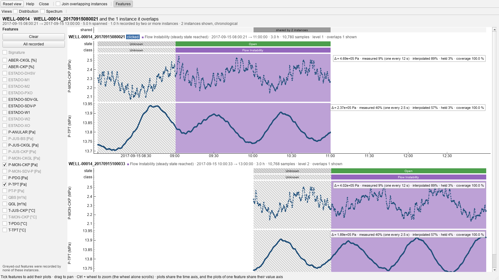
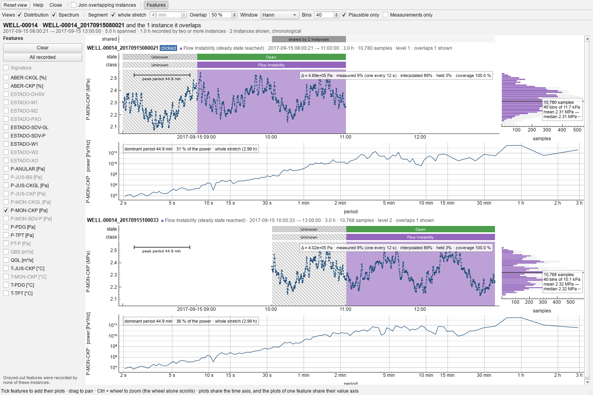
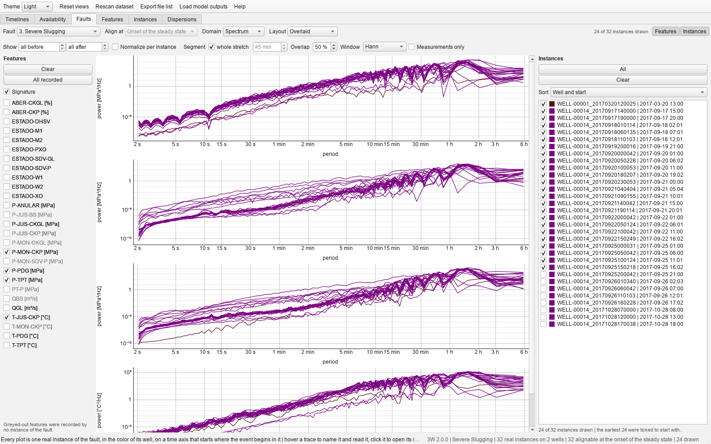

# 3W Overlap Viewer

A desktop GUI to inspect the **real instances** of the
[Petrobras 3W dataset](https://github.com/petrobras/3W): how the real instances of a well overlap in
time and how their fault labels differ, what their sensors actually recorded, and how the instances
of one fault compare across wells.

3W stores one parquet file per instance. The real instances of a well are windows cut from the
same continuous recording, so many of them overlap: the shared samples enter a dataset twice, and
under two different labels, since the end of one instance is often the start of the next. Before
anything can be done about that, one has to see it. This viewer started as the tool that shows it,
and has grown into a viewer of the real instances at large, one page per question over the same
catalogue.


## What it shows

**Timelines page** — a grid of plots, one per well. Every real instance recorded on the well is a
bar from its first to its last timestamp; instances that overlap in time are stacked on top of each
other (the row is the *stack level*), so a well recorded twice shows at a glance. The months of
silence between bursts of recording are collapsed to narrow dashed blanks, and the time scale is
uniform everywhere else: a bar's length is a duration and two bars overlap on screen exactly when
the instances overlap in time. Untick *Compress silences* for a true calendar axis.

- **Hover** a bar: it gets a heavy outline, every instance of the well that overlaps it gets a
  lighter one, the stretch they share is hatched, every other bar fades, and the status bar names
  the instance, its fault, how far the fault got, its time span, size, stack level and partners,
  and the sensors, if any, that read outside their plausible range in it. The colors those
  instances carry light up in the key above the grid, and the rest dim, so the color under the
  pointer can be named without leaving the plot.
- **Click** a bar: an instance window opens with the time series of that instance and of every
  instance it overlaps.
- **Click a color in the key**: the grid shows only the wells that recorded that fault. Clicking it
  again, or the button that appears at the right of the page's toolbar, brings every well back.
- **Join overlapping instances** (toolbar checkbox) merges the instances of a well that overlap in
  time into one bar wherever their labels agree on the shared stretch; an unlabeled sample agrees
  with anything. Instances whose labels disagree there stay apart, so what still overlaps after the
  join is exactly the labeling conflicts, and *Wells with overlaps* then lists the wells that have
  one. A bar joined from several fault folders is striped with every folder's color and says how
  many more instances it joins after its timestamp (`+2`); clicking it opens its instances as the
  single continuous recording they were cut from.
- **Bar color: Availability of a sensor** tints every bar by the share of its samples in which the
  chosen sensor is live, faint for a few and full for all, grey for a sensor that never moved,
  empty for one never recorded, so the grid becomes the history of that sensor on every well: an
  era of absence, or a scattering of it. A key of its own takes the place of the fault key while it
  is on; the outline of a bar keeps its fault hue.
- A small **amber triangle** in the corner of a bar marks an instance in which a sensor reads
  outside its plausible range; tinted by one sensor, the mark is for that sensor alone.
- **Retract the key** by clicking its title (or `Ctrl+L`) to give the grid the room. Retracted it
  still answers hovering: the entries of the instance under the pointer, and of the instances it
  overlaps, pop into the title row.
- **Drag** to pan, **Ctrl + wheel** to zoom (the plain wheel scrolls the grid), **right-click** for
  pyqtgraph's menu (view all, export).
- The page's toolbar sets the number of columns, filters the grid to the wells that have overlaps,
  and sorts wells by number, overlapping instances, instances or deepest pile-up. The right end of
  the status bar counts the instances, wells and overlaps on show.

**Availability page** — which sensors the real instances actually recorded. Every instance file
carries every column the dataset declares, whether or not the well had the sensor, so what was
recorded is a question of its own. The **Matrix** box holds two answers.

*Sensor availability* is a column per sensor, a row per group of instances, and in every cell the
share of the group in which the sensor is **live** (readings that move), **frozen** (readings, but
one constant value from end to end) or **absent**, side by side from the left, so that the fuller
the cell, the more of the sensor there is. A last row folds every instance shown. The cells take
the width of the window.



- **Rows** chooses the grouping: the fault classes (the fault-wise view: the availability maps of
  Rozo and of Rabelo's figure 2.8, over every real instance rather than a sample of them), the
  wells (a well-wise view neither has, and four wells hold over half of the real instances), or
  the instances of one well or of one fault class, one row each, in chronological order.
  **Click** a fault class or a well, on its label or on any of its cells, to see its instances one
  by one; **click an instance**, on its label or on a cell, to open its time series with that
  sensor drawn.
- A **tooltip** carries the figure the cell draws, where the pointer is, as a printed availability
  map writes it inside the cell; a cell 34 pixels wide could not hold it, and the status bar is at
  the other end of the window. The sensor headers and the row labels have one too.
- **Sensors** orders the columns as the dataset declares them or *by coverage*, the sensor live in
  the largest share of what is on show first; read along the last row for the feature-wise view.
- **Cells** splits each cell by samples, so that a six-day instance weighs more than a six-hour
  one (as Rabelo counts), or by instances, each weighing the same (as Rozo counts). The two
  disagree because instances range from hours to days.
- **Available from** sets the share of its samples a sensor needs readings in to count as
  available in an instance at all; below it the instance counts as absent for that sensor,
  readings and all. Rabelo's pipeline drops an instance whose P-TPT is more than half missing:
  50 % shows what that rule keeps.
- **Join overlapping instances** counts the bars the timelines draw when joined: overlapping
  instances whose labels agree, read as the single recording they were cut from, in which a
  sample two windows share is counted once and a sensor one window missed is filled in by
  another. The footers of the files cannot say which instants two windows share, so the first
  tick reads the data (about 15 s for 3W 2.0.0, behind a progress dialog) and keeps the result in
  the cache next to the catalogue.
- **Hover** a cell: the status bar gives the three shares, how many instances of the row have the
  sensor in each state, the smallest and largest reading, and how many instances read outside the
  plausible range. Hover a sensor's name for what it is and its plausible range, a row's label for
  what the row holds.
- A **frozen** sensor is one whose readings never move, by the same rule the instance window marks
  a plot *flat*: a count of non-missing values alone would pass a dead downhole gauge off as
  available, and in 3W 2.0.0 the downhole pressure is frozen in more than half of the real
  instances. A valve state (the `ESTADO-*` variables) is never frozen: a valve that holds one
  position for a whole recording is a fact about the well, so those variables are only ever absent
  or live.
- A small **amber triangle** in the corner of a cell marks a reading no instrument could have
  produced, in at least one instance of the row: a negative absolute pressure, a temperature
  outside −50 to 250 °C, a magnitude beyond 1e8. The limits are those the `flowml` pipeline masks
  readings by, from its survey of every instance of 3W 2.0.0; the help lists them and says why.
- Without the join, the shares are of samples as the files carry them, so a sensor recorded for
  part of an instance shows as partly absent and a sample two overlapping instances share is
  counted in both. The figures come from the footer of each parquet file (a count of the missing
  values and the minimum and maximum of every column), read in the same pass as the labels and
  cached with the catalogue, so the page costs nothing to open.

*Sensor pairs* puts the sensors on both axes and asks what no column of the first matrix answers:
how often two sensors carry a reading **at the same instant**. Two sensors can each cover half a
recording and never overlap, so a pair can be empty however well covered each of its sensors is,
and a pair with little coverage is one no model can train on and a correlation nobody should
trust. This is Rabelo's figure 2.10. Of the 351 pairs of 3W 2.0.0, 102 never carry a reading at
the same instant.



- The **diagonal** is each sensor's own coverage. **Over** counts the pairs over every real
  instance, or over those of one fault class or one well. **Count** asks either that both sensors
  be *live* in an instance for it to count, so that a dead instrument and a sensor below the
  availability threshold contribute nothing, or merely that both be *recorded*, frozen readings
  included, which is how Rabelo counts.
- **Sensors: grouped by co-occurrence** lays the sensors out so that those recorded at the same
  instant sit together, and both axes take that order. It is a spectral seriation: sensors are
  placed on a line by the second eigenvector of the Laplacian of their overlap, which puts
  strongly related ones near one another. The blocks of the matrix then read as the sets of
  sensors a well carries or lacks together, and those sets are what say which subsets of the
  dataset a model could be built on at all. *By coverage* ranks them instead, which is the view
  for asking what is best covered.
- **Join overlapping instances** applies here too, and changes the answer rather than merely the
  arithmetic: a sensor one window did not record may be there in the window it overlaps, so two
  sensors that never share a sample inside one window can share plenty inside the recording the
  windows were cut from.
- The footers cannot answer this one: a count of missing values says how much of a column is
  there, not *which* samples are there. So the first look reads the data (about 9 s for 3W 2.0.0,
  behind a progress dialog) and caches the result beside the catalogue.

**Faults page** — every real instance of one fault, from every well, side by side. Rabelo's figures
2.5 and 2.6 put two instances of the same fault next to each other to make a point: the same event,
on two wells, has a different magnitude, a different time to install itself and a different
baseline. This page makes that comparison for any fault and every well at once, on a time axis that
starts where the event begins in each instance, so that the shapes line up whatever the clock said.



- **Layout** chooses between the two ways of showing them. *Small multiples*, the default, give
  every instance a plot of its own in a grid under a heading per feature, each with its own value
  axis and its **label periods shaded behind the trace**, hatched where nobody labeled it, so that
  two dozen shapes can be read one against the next and the grid says how long each instance
  stayed in normal operation, in the transient and in the steady state, and how much of it the
  experts left unlabeled. *Overlaid* draws them all on one set of axes, which says how far apart
  the levels are and little else once there are more than a handful — the reason the grid is the
  default.
- **Columns** sets the width of the grid and **Axis** puts every small plot on its own value axis
  or all of them on one. The grid opens on the stretch of time most of the instances cover, so
  that one instance recorded for days does not leave every other plot a sliver against its left
  edge; Ctrl with the wheel zooms out to the rest.
- **Fault** picks the class; **Align at** picks the moment the axis of every instance starts from,
  the onset of the transient, the onset of the steady state, or the start of the recording. An
  instance whose labels never reach the moment chosen cannot be aligned on it and is greyed out in
  the list on the right; the moments come from the label runs the catalogue keeps, so the list
  costs nothing, and only the instances ticked are read from disk.
- **Normalize per instance** scales every series to its own level, each reading as standard
  deviations from the mean of that sensor over the whole instance, which is how Rabelo's pipeline
  normalizes: wells run at different levels, and the shape of the change is what the instances
  share. Readings outside the plausible range are left out before scaling, as the pipelines mask
  them before they normalize. **Show … h before / after** narrows the plots to the hours around the
  onset; at zero, everything recorded is drawn.
- **Hover** a line to bring it forward and name it; the status bar gives the instance, its onset,
  the time under the pointer relative to it, the label and the well status at that moment, and the
  readings of the selected features. Pointing at an instance in the list does the same.
- Beyond two dozen instances the earliest are ticked to start with, and the grid draws at most
  four dozen of them; **All** and **None** and the checkboxes choose. Readings outside the
  plausible range are left out of the value axis, so one broken gauge does not flatten every other
  line; the instance carrying them wears a ⚠ in the list.
- **Features** work as in the instance window: **Signature** ticks the variables the 3W paper puts
  on its example figure of the event, for the five events it illustrates, and features no instance
  of the fault recorded are greyed out.

**Instance window** — one block per bar of the timelines, stacked chronologically on a shared time
axis, so the overlapping stretches line up vertically. Each block has a header line, the well
operational status (`state`) and the label (`class`) as thin bands, then one plot per selected
feature. A band at the top marks the stretches recorded by two or more of the bars shown.



- A **joined bar opens as one block**: its instances are read as the single continuous recording
  they were cut from, drawn as one series over one set of bands, with a dashed line where each
  further instance begins. Every instant appears once, and what one window says nothing about the
  others fill in — a sensor it did not record, or a sample its experts left unlabeled. The `class`
  band of a merged recording therefore carries far less *Unknown* than its instances did apart: on
  the largest join of 3W 2.0.0, seventy-one windows over six days, 1.6 % of the samples against a
  third of the samples the windows carried separately. That matters because unlabeled samples are
  dropped, so the merged recording is what a model would actually be trained on. Each stretch keeps
  the color of the file that labeled it, so a normal period labeled by a *Normal Operation* file
  stays green inside a recording that goes on to develop a fault. Stacked slices also become
  unreadably thin long before seventy of them; one block does not.
- **Join overlapping instances** is also a checkbox in this window's own toolbar, and **the group a
  window opens on is all it is ever about**: the box merges exactly the instances on screen, so it
  answers what this group alone amounts to rather than what the whole well does. Two of them that
  overlap only through an instance outside the window therefore stay apart, and nothing is ever
  brought in. It changes this window and nothing else, neither the grid nor any other instance
  window, and turning it off lands exactly where it started, feature selection included. A window
  opened from a bar the timelines had already merged is showing that merge and has nothing of its
  own left to do, so its box is ticked and disabled; a group with nothing to merge disables it too,
  and says which case it is.
- **Features** are chosen with the checkboxes on the left (features none of the instances recorded
  are greyed out). By default only the first feature in alphabetical order among the recorded ones
  is plotted; opened from the availability page, the sensor clicked is.
- **Signature** ticks, in one click, the handful of variables whose joint behaviour identifies the
  event — the ones the 3W paper puts on its example figures. Only the five events it illustrates
  have one (Normal Operation, Spurious Closure of DHSV, Severe Slugging, Quick Restriction in PCK,
  Hydrate in Production Line); for any other the box is disabled and says why. The screenshot above
  is the severe-slugging signature: four variables cycling in phase, as figure 6 of the paper
  describes.
- All plots **share the time axis**, and the plots of one feature **share their value axis** across
  instances, so the same reading is at the same height everywhere.
- A **crosshair** follows the pointer through every plot; the status bar gives the time under it and,
  per instance, the label, the operational status and the selected readings at that time.
- Each plot reports the total variation of the signal (Δ = max − min, marked *flat* for a frozen
  sensor) and the share of samples carrying a reading. A sensor never moving is held on a padded
  axis instead of being autoscaled into noise.
- A **reading outside the plausible range** is drawn in amber over the trace, sample by sample, so
  the stretch that is garbage is seen for what it is; the panel's figures call it out, the header
  of the block names the sensors, and the feature's checkbox wears a ⚠.

**Signal views** — three more views of every feature plot of the instance window, each placed
where it shares an axis with the trace, and a *Domain* box on the Faults page that draws every
instance of a fault in one of them. The events are slow: severe slugging on WELL-00014 cycles every
50 to 90 minutes, flow instability on WELL-00001 every 45, so a six-hour instance holds four to
seven cycles, and the spectral axis is a **period**, logarithmic, not a frequency that would read
0.0002 Hz.



- **Distribution** is a marginal histogram to the right of the trace, turned on its side so its
  value axis is the trace's; the bars are stacked by label period in the class colors, so how the
  event moves the readings is read inside one instance, and a solid line marks the mean, a dashed
  one the median. A bimodal shape is an oscillation.
- **Spectrum** is Welch's estimate of the power spectral density against period, both logarithmic,
  the mean and the linear trend removed first and the missing samples interpolated, readings
  outside the plausible range left out. It sits beside the spectrogram sharing its period axis, or
  in its place on its own, the period along the bottom. Its caption gives the **dominant period and
  its share of the power**: a few percent for a normal instance, half or more for an oscillating
  one; and one cycle of that period is laid as a bar against the trace, so the claim can be
  checked against the waves.
- **Spectrogram** sits under the trace on the shared time axis, the period up the side, the power
  as a shade of the trace color. It earns its place over merged recordings of days, where the
  period drifts (90 minutes on 18 September 2017 down to 51 by 28 October on WELL-00014); on a
  single six-hour instance it resolves periods up to three quarters of an hour only, and says so.
- The histogram and the spectrum are counted over the **stretch of time on screen**, so zooming is
  brushing; the spectrogram covers the whole recording. A merged recording is transformed as the
  single series it is, never stitched from its parts, and its seams are drawn on the spectrogram.
- **Segment**, **Overlap**, **Window** and **Bins** are the parameters, the same widgets in both
  windows, on a toolbar row of their own so that a narrow window never hides them. Nothing longer
  than a segment can be resolved, so the plots grey the periods beyond it; with *whole stretch*
  ticked the spectrum is the periodogram of everything on screen, the only way to see a slugging
  line, since a segment of a few minutes holds no cycle of it.
- On the **Faults page**, *Overlaid* spectra read together where overlaid traces did not, the
  question being whether their peaks line up; histograms are drawn as a share of each instance's
  samples, with the mean and the median of each as lines in the grid, and *Normalize per instance*
  puts different wells on one z-score axis. The hours before and after the onset pick the stretch
  transformed, so "2 h after" gives the spectrum of the fault alone. **Features** and
  **Instances**, at the right end of the toolbar, hide the feature panel and the instance list to
  give the plots their width; the instance window has the same **Features** toggle beside *Join
  overlapping instances*.



There is deliberately no phase spectrum of a single signal (its phase depends on where the file
begins and tells nothing the trace does not) and no wavelet transform (the spectrogram covers the
time-frequency question until it proves too coarse); the cross-spectrum phase between two sensors is
left for a later version.

The pages are interactive counterparts of stage-0 figures of the `flowml` pipeline: the timelines
of `faults_per_well.pdf` and `fault_<n>_real_instances.pdf`, the availability page of the cleaning
rules the pipeline applies before anything is computed, the faults page of the per-fault figures.

**Help** (`F1` anywhere) explains what is on screen, from the 3W papers in
[`docs/papers/`](docs/papers): every class label and what the literature says it does to the
readings, with the example figure of the 2.0.0 paper reproduced and commented for each of the five
events it illustrates; every variable, where in the production system it is measured and the
position number that marks its sensor in the paper's schematic; every well operational status, the
unknown one hatched as the bands hatch it; the three states of the availability page, the plausible
ranges and why they are what they are; and how to work the pages and the windows. Two schematics
of the production system illustrate it. Where the papers describe no signature for an event, the
help says so rather than inventing one.


## Color code

A bar's hue is the **fault-class folder** the instance comes from, and its tint says how far the
fault developed inside that window: full strength once the steady fault state is labeled, lighter
when only the transient state is, lightest when the window never leaves normal operation (43 of the
instances filed under *Hydrate in Service Line* never do). Normal instances (folder 0) stay full
strength. The legend above the grid keys every color actually drawn, one swatch per fault and
reach.

In the instance window the `class` band carries these exact colors (a normal stretch of a fault
instance has the *no fault reached* tint of that fault, a transient stretch the *transient* tint,
and so on), and the plot backgrounds use the same hues on the same three-step ladder, compressed
toward white so the trace stays legible. Unlabeled stretches are grey; the `state` band uses one
color per operational status.

A fault that appears at several tints is a gradient, and its steps are only readable side by side,
so the key gives such a group a row of its own; faults that draw a single color flow together on
the remaining rows, on a fixed column pitch so that entries line up down the rows.

Stretches the experts left unlabeled are hatched rather than merely grey: two of the fault hues are
themselves grey, and a texture says *nothing is known here* where one more shade would just read as
one more class.

With *Join overlapping instances* ticked a bar may stand for several instances. When they come from
different folders the bar is striped with every color they had, top to bottom in the order of the
key, so each stripe is still a color the key names; its outline is the hue of the event the joined
labels develop furthest, and hovering it lights up every one of its entries in the key.

The availability page has three colors of its own, keyed at the right of its title line: a slate
blue for *live* that no fault hue comes close to, so a cell can never be read as a class; a grey
under a flat line for *frozen*, the line saying what the color alone would not; and the empty cell
for *absent*. The timelines take the same three when they are tinted by a sensor, the blue on a
ramp from faint to full with the share of samples live. Amber, used nowhere else, marks a reading
outside the plausible range, wherever it appears: the corner of a cell or a bar, the samples of a
trace, the caption and the header of an instance plot, the checkbox of a feature. The rows of the
fault classes and of the instances carry the fault hue of the timelines as a small square before
their label.

The faults page colors its lines by **well**, from a palette of twelve that no other page uses,
cycled when a fault spans more wells; the list on the right is its key.

## Light and dark

The **Theme** box of the toolbar switches both halves of the viewer at once — the windows Qt paints
and the plots pyqtgraph paints — so they can never disagree; *System* follows the desktop, and
follows it live. The choice is remembered between runs, and `--theme light|dark|system` overrides it
for one run.

The dark mode is not the light one inverted. The fault hues are lifted, because a categorical
palette chosen to read as ink on paper sinks into a dark ground, and the ladder of tints mixes
toward the plotting background of the mode rather than always toward white, so that a weaker tint
always means less of the hue and more of the ground, whichever way round the two are. The trace of a
time series crosses to the other end of the scale for the same reason: dark on the pale shading of
the light mode, pale on the dark shading of the other. Every color of a mode is stated in one place,
[`theme.py`](src/overlap_viewer/theme.py), and the windows rebuild from it when the mode changes.

## Running

Requires Python 3.11 or newer, [uv](https://docs.astral.sh/uv/) and a local copy of the 3W dataset.

```bash
cd app                     # this directory
uv sync                    # creates .venv with PySide6, pyqtgraph, pandas, numpy, pyarrow
uv run overlap-viewer --raw-dir /path/to/3W/dataset
```

From the root of the `flow-assurance-ml` repository the same is `uv run --project app overlap-viewer`.
Without `--raw-dir`, the dataset is taken from the `FLOWML_RAW_DATA_DIR` environment variable, then
from `../3W/dataset`, `dataset` or `3W/dataset` relative to the working directory; if none holds a
dataset, a folder dialog asks for it. `uv run main.py` and `uv run python -m overlap_viewer` are
equivalent entry points.

| Option | Default | Meaning |
| ------ | ------- | ------- |
| `--raw-dir PATH` | see above | root of the 3W dataset (the folder holding `0/` … `9/` and `dataset.ini`) |
| `--columns N` | 2 | plots per row of the timelines (1 to 4) |
| `--gap-hours H` | 12 | a silence at least this long splits a well's recording into two bursts |
| `--theme MODE` | the last one chosen | `light`, `dark`, or `system` to follow the desktop |
| `--no-cache` | off | read every instance again instead of using the cached catalogue |

The first launch reads the time span and labels of every real instance, and what every sensor
recorded from the footer of each file (about 7 s for the 1,119 instances of 3W 2.0.0, behind a
progress dialog), and caches the result under the platform cache directory
(`~/.cache/overlap-viewer/` on Linux). Later launches validate the cache against the files' sizes
and modification times and start instantly; any changed, added or removed file triggers a fresh
scan, as does the *Rescan dataset* button, and so does a version of the viewer that records more
about each instance than the cache holds (the label runs the join reads, and the sensor figures the
availability page reads, were added this way). Two figures the footers cannot give are read from the
data the first time they are asked for, each behind its own progress dialog and cached the same way:
the merged figures the availability page's join needs, sensor by sensor and pair by pair, in one
pass (about 30 s), and the pair counts of the instances as the dataset stores them (about 9 s).

Only real instances (`WELL-*` files) are shown: simulated and hand-drawn instances have no well to
overlap on and no sensor to lack, and this viewer is about the real ones.

## Layout

```
app/
├── pyproject.toml            standalone uv project (package overlap_viewer, script overlap-viewer)
├── main.py                   runs the viewer from a checkout without installing
├── docs/
│   ├── assets/               screenshots · the platform schematics the help shows
│   └── papers/               the 3W data articles, the thesis and the graduation project the help draws on
├── tests/test_backend.py     backend tests on a synthetic miniature of the 3W layout
└── src/overlap_viewer/
    ├── config.py             dataset fallbacks · plausible ranges · the tint ladder · signatures · layout · cache
    ├── dataset.py            dataset.ini · instance catalogue and its cache · sensor figures from the footers, from merged recordings and pair by pair · overlaps and joins per well
    ├── availability.py       the three states of a sensor in a bar · groups folded into shares of samples or of bars · the pair map of a scope
    ├── faults.py             where the event begins in an instance · z-scores · the plausible extent of a series
    ├── spectral.py           the signal views, numpy only: a series prepared · Welch's density and the dominant period · the spectrogram on a log period grid · histograms stacked by label
    ├── timemap.py            gap-compressed (or calendar) time axis in hours
    ├── labels.py             label kinds and names · runs, their agreement and their merge · feature statistics · coverage counts
    ├── theme.py              every color of the light and of the dark mode
    ├── palette.py            fault hues tinted by reach · legend entries
    ├── help_text.py          what the help says: classes, variables, statuses, availability, usage
    ├── styling.py            installing a theme into Qt and pyqtgraph · the saved mode
    ├── loading.py            progress dialogs · cache of loaded instances
    ├── items.py              pyqtgraph items: segments, instance bars and their marks, time axis, anchored text
    ├── spectral_items.py     the parameter widgets, the period axis, the spectrogram ramp and the builders of the signal views
    ├── heatmap.py            the matrix widget of the availability page, its tooltips and the keys of the states
    ├── legend.py             the clickable color key and its flow layout
    ├── help.py               the help window
    ├── overview.py           the timelines page: the grid of well timelines
    ├── availability_page.py  the availability page: rows, sensors, the matrix and what it says
    ├── faults_page.py        the faults page: the instances of one fault as small multiples, or over one another, in time, as distributions or as spectra
    ├── instance_window.py    the time series of a group of overlapping instances, with their distributions, spectra and spectrograms
    ├── window.py             the main window: the pages, the shared toolbar and status bar, the windows they open
    └── app.py                command line and start-up
```

The backend (`config`, `dataset`, `availability`, `faults`, `spectral`, `timemap`, `labels`,
`theme`, `palette`, `help_text`) depends on pandas, numpy and pyarrow only, and reads what the dataset states
about itself from `dataset.ini` (event names and labels, which events have a transient, the
transient offset, variable units, which variables are valve states), with built-in fallbacks for
3W 2.0.0. The frontend is PySide6 and pyqtgraph. The lane-packing rule that stacks the instances is
the one the `flowml` pipeline uses to drop overlapping instances: what the timelines show on stack
level 2 or higher is exactly what the pipeline removes by default. The plausible ranges are the
pipeline's cleaning rules.

The help text and the signature variables come from the 3W Dataset 2.0.0 data article
([doi:10.1038/s41597-026-07225-z](https://doi.org/10.1038/s41597-026-07225-z)); its figures 3 to 7
are the source of the five published signatures and are reproduced in the help
(`docs/assets/signature-*.png`), and its table 2 gives the position of every sensor in its
figure 1. The availability page follows the availability map of
[G. Rozo](https://github.com/GabrielRozo123/3W/blob/new_3w_datasets_overviews/dataset/demos/GabrielRozo/main.ipynb)
and section 2.3.2 of the
[final graduation project of G. Rabelo de Oliveira](docs/papers/final_graduation_project_gabriel_rabelo.pdf),
counting the real instances only, and every one of them; its pair matrix is his figure 2.10, and
the faults page makes the comparison of his figures 2.5 and 2.6 for every fault.

## Development

```bash
uv sync --all-groups       # adds pytest and ruff
uv run pytest
uv run ruff check . && uv run ruff format .
```

Tests cover the backend only; the widgets were checked by rendering them offscreen
(`QT_QPA_PLATFORM=offscreen`) against the full dataset.
