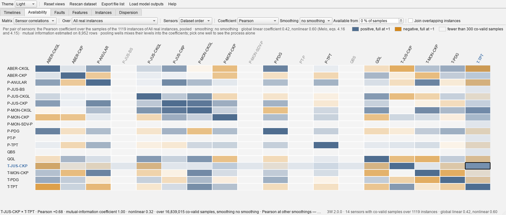

# Availability page
Which sensors the real instances actually recorded. Every instance file
carries every column the dataset declares, whether or not the well had the sensor, so what was
recorded is a question of its own. The **Matrix** box holds three answers.

*Sensor availability* is a column per sensor, a row per group of instances, and in every cell the
share of the group in which the sensor is **live** (readings that move), **frozen** (readings, but
one constant value from end to end) or **absent**, side by side from the left, so that the fuller
the cell, the more of the sensor there is. A last row folds every instance shown. The cells take
the width of the window.

- **Rows** chooses the grouping: the fault classes (the fault-wise view: the availability maps of
  Rozo and of Rabelo's figure 2.8, over every real instance rather than a sample of them), the
  wells (a well-wise view neither has, and four wells hold over half of the real instances), or
  the instances of one well or of one fault class, one row each, in chronological order.
  **Click** a fault class or a well, on its label or on any of its cells, to see its instances one
  by one; **click an instance**, on its label or on a cell, to open its time series with that
  sensor drawn.
- A **tooltip** carries the figure the cell draws, where the pointer is, as a printed availability
  map writes it inside the cell; a cell 34 pixels wide could not hold it, and the status bar is at
  the other end of the window. The sensor headers and the row labels have one too.
- **Sensors** orders the columns as the dataset declares them or *by coverage*, the sensor live in
  the largest share of what is on show first; read along the last row for the feature-wise view.
- **Cells** splits each cell by samples, so that a six-day instance weighs more than a six-hour
  one (as Rabelo counts), or by instances, each weighing the same (as Rozo counts). The two
  disagree because instances range from hours to days.
- **Available from** sets the share of its samples a sensor needs readings in to count as
  available in an instance at all; below it the instance counts as absent for that sensor,
  readings and all. Rabelo's pipeline drops an instance whose P-TPT is more than half missing:
  50 % shows what that rule keeps.
- **Join overlapping instances** counts the bars the timelines draw when joined: overlapping
  instances whose labels agree, read as the single recording they were cut from, in which a
  sample two windows share is counted once and a sensor one window missed is filled in by
  another. The footers of the files cannot say which instants two windows share, so the first
  tick reads the data (about 15 s for 3W 2.0.0, behind a progress dialog) and keeps the result in
  the cache next to the catalogue.
- **Measured vs filled** splits the live share of every cell into the samples that were measured,
  solid, and the samples the historian filled in between measurements, pale — most of every live
  cell on 3W 2.0.0 (see the note on sampling in the root README.md). The tooltip and
  the status bar then give the share and the interval between measurements. The split is of
  samples, so it rests while the cells count instances, and it applies to the joined bars as much
  as to the instances, each merged recording profiled as the one series it is. The first tick
  reads every instance in full (about 100 s for 3W 2.0.0, behind a progress dialog) and keeps the
  result in the cache.
- **Hover** a cell: the status bar gives the three shares, how many instances of the row have the
  sensor in each state, the smallest and largest reading, and how many instances read outside the
  plausible range. Hover a sensor's name for what it is and its plausible range, a row's label for
  what the row holds.
- A **frozen** sensor is one whose readings never move, by the same rule the instance window marks
  a plot *flat*: a count of non-missing values alone would pass a dead downhole gauge off as
  available, and in 3W 2.0.0 the downhole pressure is frozen in more than half of the real
  instances. A valve state (the `ESTADO-*` variables) is never frozen: a valve that holds one
  position for a whole recording is a fact about the well, so those variables are only ever absent
  or live.
- A small **amber triangle** in the corner of a cell marks a reading no instrument could have
  produced, in at least one instance of the row: a negative absolute pressure, a temperature
  outside −50 to 250 °C, a magnitude beyond 1e8. The limits come from a survey of every instance
  of 3W 2.0.0; the help lists them and says why.
- Without the join, the shares are of samples as the files carry them, so a sensor recorded for
  part of an instance shows as partly absent and a sample two overlapping instances share is
  counted in both. The figures come from the footer of each parquet file (a count of the missing
  values and the minimum and maximum of every column), read in the same pass as the labels and
  cached with the catalogue, so the page costs nothing to open.

*Sensor pairs* puts the sensors on both axes and asks what no column of the first matrix answers:
how often two sensors carry a reading **at the same instant**. Two sensors can each cover half a
recording and never overlap, so a pair can be empty however well covered each of its sensors is,
and a pair with little coverage is one no model can train on and a correlation nobody should
trust. This is Rabelo's figure 2.10. Of the 351 pairs of 3W 2.0.0, 102 never carry a reading at
the same instant.

- The **diagonal** is each sensor's own coverage. **Over** counts the pairs over every real
  instance, or over those of one fault class or one well. **Count** asks either that both sensors
  be *live* in an instance for it to count, so that a dead instrument and a sensor below the
  availability threshold contribute nothing, or merely that both be *recorded*, frozen readings
  included, which is how Rabelo counts.
- **Sensors: grouped by co-occurrence** lays the sensors out so that those recorded at the same
  instant sit together, and both axes take that order. It is a spectral seriation: sensors are
  placed on a line by the second eigenvector of the Laplacian of their overlap, which puts
  strongly related ones near one another. The blocks of the matrix then read as the sets of
  sensors a well carries or lacks together, and those sets are what say which subsets of the
  dataset a model could be built on at all. *By coverage* ranks them instead, which is the view
  for asking what is best covered.
- **Join overlapping instances** applies here too, and changes the answer rather than merely the
  arithmetic: a sensor one window did not record may be there in the window it overlaps, so two
  sensors that never share a sample inside one window can share plenty inside the recording the
  windows were cut from.
- The footers cannot answer this one: a count of missing values says how much of a column is
  there, not *which* samples are there. So the first look reads the data (about 9 s for 3W 2.0.0,
  behind a progress dialog) and caches the result beside the catalogue.

*Sensor correlations* asks the next question: of two sensors recorded together, how do they move
together? Melo's exploratory methodology (doctoral thesis, section 4.1.5) reads the relations
between variables three ways at once, and the matrix offers the three
([`algorithms/correlation.py`](../../src/overlap_viewer/algorithms/correlation.py)).

- **Coefficient**: *Pearson*, the linear correlation, blue positive and amber negative, full at ±1,
  exact over every sample of the scope in which both sensors carry a plausible reading, pooled;
  *Mutual information*, Laarne's coefficient √(1 − e⁻²ᴵ) of the mutual information estimated by
  nearest neighbours on an even subsample of a few thousand of the same samples, 0 for
  independent sensors and 1 for a deterministic relation, equal to |Pearson| when the pair is
  jointly Gaussian; *Nonlinear*, Zhang's ρ_I·(1 − |ρ|), what the second says beyond the first. The
  title sums each into Melo's global coefficient (his equations 4.16 and 4.15). A pair with fewer
  than 300 co-valid samples is left blank, and the valve states are left out: a position is not a
  measurement. The two nonlinear coefficients need the `analysis` extra.
- **Smoothing** takes a moving average of 5 s to 5 min before the coefficients, all lengths in one
  pass; the tooltip of a cell gives the Pearson coefficient at every length. Melo's figures 4.11
  and 4.26 show a process's coefficients rising as the window grows, and the historian's lines
  between measurements (below) were his reason to distrust any coefficient taken on the grid. What
  3W 2.0.0 says is more sobering: pooled over a scope, the coefficients hardly move with smoothing
  (the global coefficient of the whole dataset goes from 0.420 to 0.424 between none and five
  minutes), because a pooled coefficient is set by the levels the sensors sit at from one instance
  to the next, not by what happens between two measurements. The lines' spurious dynamics live
  inside one instance, at the scale of seconds, where the Dispersion page looks.
- **Over** is the scope, and it carries the caveat that does bite, stated in the title: pooling the
  instances of a class or of the whole dataset mixes the levels of different wells into the
  coefficient. With every well pooled the mutual-information coefficient of almost every pair reads
  1.00, since knowing one sensor's level is enough to know the well and so the other's; over one
  well (WELL-00007) nearly every pair of pressures and temperatures correlates at ±0.99, through
  the well's shut-ins and restarts. **Join overlapping instances** pools the merged recordings of
  the bars, so that a sample two windows share is counted once. The first look at a scope reads its
  instances behind a progress dialog (about two minutes for the whole dataset); the result is kept
  for the session.