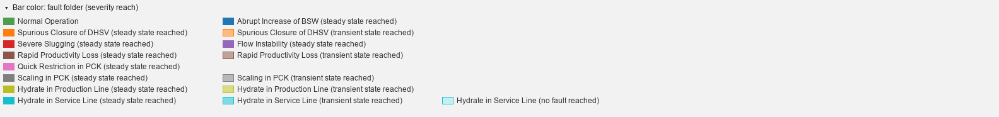

# Color code

A bar's hue is the **fault-class folder** the instance comes from, and its tint says how far the
fault developed inside that window: full strength once the steady fault state is labeled, lighter
when only the transient state is, lightest when the window never leaves normal operation (43 of the
instances filed under *Hydrate in Service Line* never do). Normal instances (folder 0) stay full
strength. The legend above the grid keys every color actually drawn, one swatch per fault and
reach.

In the instance window the `class` band carries these exact colors (a normal stretch of a fault
instance has the *no fault reached* tint of that fault, a transient stretch the *transient* tint,
and so on), and the plot backgrounds use the same hues on the same three-step ladder, compressed
toward white so the trace stays legible. Unlabeled stretches are grey; the `state` band uses one
color per operational status.

A fault that appears at several tints is a gradient, and its steps are only readable side by side,
so the key gives such a group a row of its own; faults that draw a single color flow together on
the remaining rows, on a fixed column pitch so that entries line up down the rows.

Stretches the experts left unlabeled are hatched rather than merely grey: two of the fault hues are
themselves grey, and a texture says *nothing is known here* where one more shade would just read as
one more class.

With *Join overlapping instances* ticked a bar may stand for several instances. When they come from
different folders the bar is striped with every color they had, top to bottom in the order of the
key, so each stripe is still a color the key names; its outline is the hue of the event the joined
labels develop furthest, and hovering it lights up every one of its entries in the key.

The availability page has three colors of its own, keyed at the right of its title line: a slate
blue for *live* that no fault hue comes close to, so a cell can never be read as a class; a grey
under a flat line for *frozen*, the line saying what the color alone would not; and the empty cell
for *absent*. With *Measured vs filled* on, the live span of a cell ends in a paler blue for the
samples the historian filled in, the solid part being the measurements. The timelines take the
same colors when they are tinted by a sensor, the blue on a ramp from faint to full with the share
of samples live, or with the share of the live samples that were measured. Amber, used nowhere else, marks a reading
outside the plausible range, wherever it appears: the corner of a cell or a bar, the samples of a
trace, the caption and the header of an instance plot, the checkbox of a feature. The rows of the
fault classes and of the instances carry the fault hue of the timelines as a small square before
their label.

The faults page colors its lines by **well**, from a palette of twelve that no other page uses,
fixed per well over the whole catalogue so that a well keeps its color from one fault to the next,
and cycled only when the dataset holds more wells than the palette has colors; the list on the
right is its key. The well code and the fault code are drawn in the same plot (a trace over the
shading of its label periods, the outline of a histogram over stacks in the fault's own hue), so
they are separated by **register** rather than by hue, which ten fault hues leave no room for.
Every well color sits on the far side of every fault hue in luminance: deeper than all of them in
the light mode, paler than all of them in the dark one. That is the band the trace color already
keeps to, and for the same reason: a line has to stay legible over every shading it can be drawn
on.