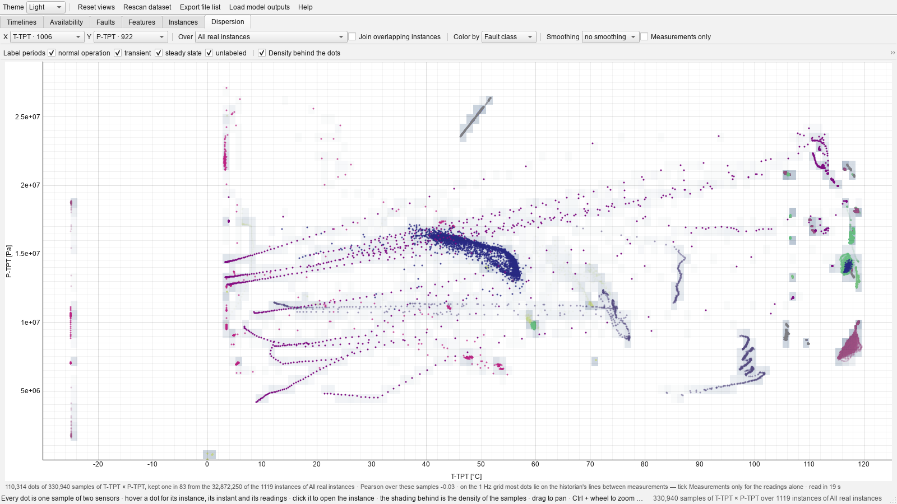

# Dispersion page
Two sensors against each other, every sample of the instances of a scope one
dot, the density of the samples shaded behind. It is the scatter plot of Melo's exploratory
methodology made readable: his figures of two 3W variables (thesis, section 4.2.5) were where he
saw the historian's hand, the cloud of two interpolated series being the trajectories of the two
interpolations, straight segments between the few instants that were measured. A static scatter
of a million points is a smear; this one names the instance and the instant of every dot on hover,
opens the instance on a click, and thins itself to the measurements alone
([`algorithms/dispersion.py`](../../src/overlap_viewer/algorithms/dispersion.py),
[`frontend/dispersion_page.py`](../../src/overlap_viewer/frontend/dispersion_page.py)).

- **X**, **Y** are the two sensors (analog ones; readings outside the plausible range left out) and
  **Over** the scope: every real instance, one fault class or one well, the joined bars with **Join
  overlapping instances**. The first look at a scope reads its instances in full behind a progress
  dialog, every analog sensor at once, and keeps an even subsample of the rows for the session,
  400,000 in all (one row in a few for one well, one in fifty for the whole dataset, which takes
  about two minutes), so that everything else is instant; at most 150,000 of them are drawn as
  dots, evenly, and the **density** behind the dots, a two-dimensional histogram on a logarithmic
  scale, counts them all.
- **Color by** colors the dots by fault class, by well or by label period, or shows the density
  alone; **Label periods** switches the samples of normal operation, the transient, the steady
  state and the unlabeled on and off, so that a fault's steady state alone shows the relation under
  the fault and normal operation alone the relation it departs from.
- **Measurements only** keeps the samples at which both sensors were actually read, a few per cent
  of the dots, from which the historian's straight trajectories vanish. It carries a caveat of its
  own: a historian archives a reading when it has moved enough, so the instants at which both
  sensors were archived are instants at which both moved, and this cloud favours the relation
  between them — over the severe-slugging instances P-TPT × T-TPT reads +0.40 on every sample and
  +0.95 on the 5 % at which both were measured. **Smoothing** applies a moving average of 5 s to
  5 min to both series first, which is what a pipeline's smoothing does to the cloud (and reads the
  scope again, once per window). The caption gives the counts, one in how many, and the Pearson
  coefficient over the samples on show, so that the cloud and the correlation matrix can be read
  against each other: no pooled coefficient betrays the lines, every scatter plot does.
- **Hover** a dot for its instance, its instant, its label period, its two readings and whether
  each was measured or filled in; the status bar also counts the samples in the density cell under
  the pointer. **Click** a dot to open its instance. Pooling wells carries its usual caveat: two
  clouds side by side may be two wells rather than one relation, and *Color by: Well* tells them
  apart.