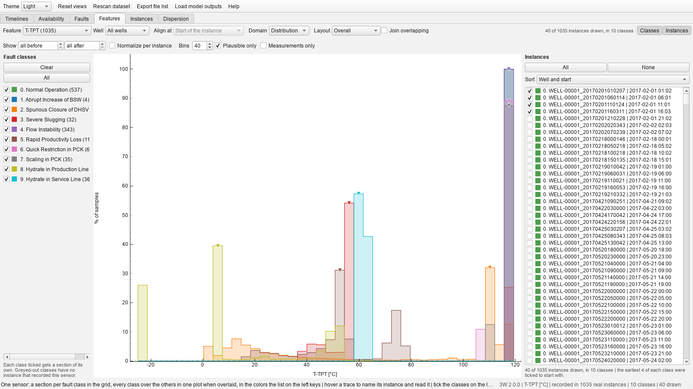

# Features page
The faults page with the question turned round. It fixes one **sensor** and
gives every fault class a section, so that what a gauge reads under a hydrate can be set beside
what the same gauge reads under severe slugging and under normal operation. That is the
feature-wise grouping of the catalogue: the timelines are the well-wise one and the faults page the
fault-wise one. The two pages share their whole drawing machinery: the same two layouts, the same
three domains, the same window of hours around an onset, the same transforms and the same hover.

- **Feature** picks the sensor; the count beside a name is how many real instances recorded it, and
  one no instance recorded is greyed out. The page opens on the sensor the most instances record a
  *moving* reading of, which keeps a valve state out of the way of the default: nearly every
  instance carries one, and a valve holding its position for a whole recording would open the page
  on a row of flat lines whose spectrum declines every one of them. **Well** narrows everything to
  one well, so the classes are compared at one place and one set of instruments.
- **The classes on the left** choose the sections and are the color key; **the instances on the
  right** choose what is read from disk. The earliest few of *each* class are ticked to start with,
  rather than the earliest few overall (a class whose instances all come later would otherwise
  open with nothing in its section), and the grid spends its cap per class for the same reason.
- **Layout** means something particular here. *Small multiples* give every instance a plot of its
  own in a grid under a heading per class (with the samples it draws and how many were measured);
  because the heading already names the class, the trace
  takes the neutral color and the class hues are left to the shading of the label periods behind it
  and to the stacks of a histogram, which a line of the same hue would vanish into. **Overlaid**
  puts every class on one set of axes, each instance in its class's color: the view the page
  exists for, and the natural one for histograms and spectra, where the question is whether the
  classes sit at different values or peak at different periods.
- **Click** a plot, or an instance's name in the list, to open its instance window, as on the
  Faults page: from a plot on the sensor on show, from the list on the signature of its class.

- **Align at** starts on the start of the recording, the one anchor every class has: normal
  operation has no transient and no steady fault state, so anchoring on either would silently leave
  every normal instance out.