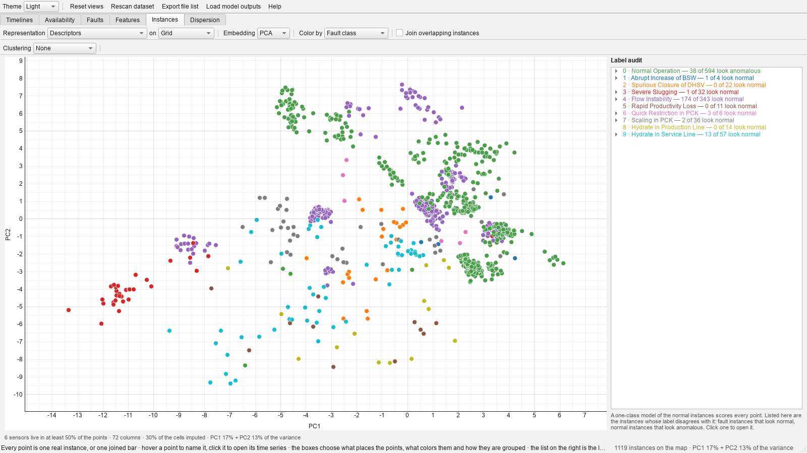

# Instances page
Every real instance as one point, from above. The other pages look at the
instances one well, one fault or one sensor at a time; this one places all of them on a plane by
what their sensors amount to, colors them by class, by well, by cluster, by typicality or by the
verdict of a one-class model, and opens any of them on a click. The unit is the instance, never
the window a pipeline cuts: 1,119 points, which a reader can hold in view. Nothing here is a model
of the process; everything is an analysis of the catalogue, recomputed on every change of a box.

- **Representation** is what an instance becomes a point by. *Descriptors*: per sensor the moments,
  the quantiles, the autocorrelation time, the signal-to-noise ratio, the Gaussianity slope and how
  it was measured (the profile pass commented in the note on sampling in the root README.md),
  one standardized column each; a sensor enters only if it is live in at least half of the points
  (six on 3W 2.0.0), and a cell an instance lacks takes the column's median, the note under the
  map saying how much was made up that way. *Shape only* leaves the levels out, so that the level
  of a well does not place its instances. *DTW of a sensor, within a class* is the 3W Toolkit's
  own comparison of instances, the dynamic time warping distance between the series of one sensor,
  each z-scored and averaged into 400 blocks first (a matter of cost, not the resampling of every
  instance to one length), under a window of a tenth of the length.
- **on** chooses whether the descriptors were taken on the 1 Hz grid, which is what a pipeline
  reads, or on the measurements alone, which is what the process did; on the grid the historian's
  lines make every series look smoother than the process, so the map drawn from the grid is partly
  a map of how each sensor was archived.
- **Embedding** lays the points on the plane: *PCA* (numpy; the axes say how much variance each
  carries, and on a DTW representation it becomes the principal coordinates of the distances),
  *t-SNE* and *UMAP*, which keep neighbourhoods rather than distances and take a few seconds on
  the whole dataset.
- **Clustering** groups the points — k-means, a Gaussian mixture, agglomerative clustering, DBSCAN,
  the list Siqueira's notebooks on 3W work through — and the line beside it scores the result: the
  silhouette, and the agreement with the fault classes and with the wells as the adjusted Rand
  index and the normalised mutual information, 1 for a clustering that is the classes (or the
  wells) under other names. That is the question the page asks: whether what places the instances
  is the event or the well they came from.
- **Typicality** is how ordinary an instance of its class each one is: its distance to the medoid
  of its class in the representation, as a rank inside the class (1 the medoid, 0 the farthest).
  It colors the points, it is a *Bar color* of the Timelines, and it is a *Sort* order of the
  instance lists of the Faults and Features pages, whose tooltips carry it.
- The **label audit** on the right is what a one-class model of the normal instances (a
  radial-basis one-class SVM, as in Siqueira's notebooks, 5 % of the normal instances allowed
  outside its boundary) makes of every label: class by class, the fault instances that *look
  normal* to it and the normal instances that *look anomalous*, each a click away. It is an audit
  of the labels, not a detector; under the *Novelty* coloring the disagreements wear a dark ring.
- **Join overlapping instances** makes the points the bars of the joined view, each merged
  recording profiled as the one series it is; the Timelines take the map's colorings only on the
  view it was drawn on.
- The first time the page is shown it reads every instance in full behind a progress dialog (the
  same pass the availability split uses) and keeps the result in the cache. t-SNE, the
  clusterings, their scores and the one-class model need the `analysis` extra, UMAP the `umap`
  extra, the DTW representation the `dtw` extra; a control whose extra is missing is greyed, and
  its tooltip names the install command.